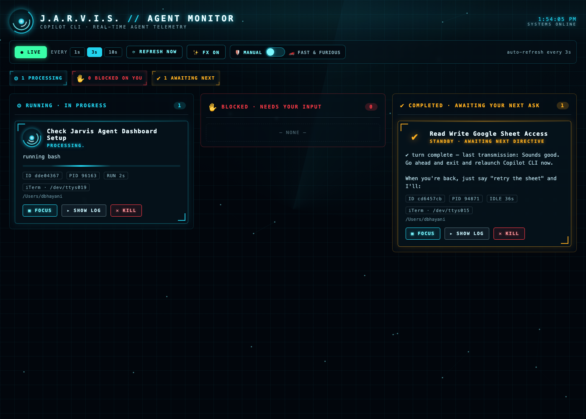

# Copilot Agent Monitor

A **local, read-only** dashboard that watches every running GitHub Copilot CLI
session ("agent") on this machine and highlights the ones that are **waiting for
you**.



It shows the same live view in two places at once:

- **Terminal** — an auto-refreshing table (rings the bell when an agent starts
  waiting on you).
- **Web** — `http://localhost:8787`, with pulsing red cards, a top banner, a
  sound, and a browser notification the moment an agent needs you.

## States detected

| State | Meaning |
|-------|---------|
| ⛔ `WAITING_PERMISSION` | Blocked on an approval prompt (e.g. a shell command). |
| ❓ `WAITING_QUESTION`   | Blocked on an `ask_user` question. |
| ⏸ `WAITING_INPUT`      | Finished its turn — awaiting your next message. |
| ▶ `WORKING`            | Actively running tools / thinking. |

The first three all count as **"waiting on you"** and are pushed to the top,
highlighted, and alerted.

## Actions (web dashboard)

Each agent card has two buttons:

- **↪ Focus terminal** — jumps you straight to the terminal tab/window running
  that agent so you can type your answer.
  - **iTerm2 / Terminal.app:** selects the *exact* tab by matching its TTY and
    brings it to the front.
  - **VS Code / Cursor:** their integrated terminal has no per-tab AppleScript
    API, so the app is activated and the card shows the TTY (e.g. `/dev/ttys011`)
    — run `tty` in a tab to find the match.
- **■ Kill** — sends `SIGTERM` to that agent's process (with a confirm prompt).

The card meta line shows the hosting app + TTY and the working directory.

## 🏎 FAST & FURIOUS mode (auto-approve)

An **opt-in** toggle in the web dashboard. While it is ON, any agent that becomes
blocked on a `WAITING_PERMISSION` prompt is automatically approved by sending
Copilot CLI's built-in `/allow-all` command straight into its terminal — you
never have to touch the yes/no prompt yourself.

How the command reaches each terminal:

- **iTerm2:** targeted precisely via `write text` to the session owning the TTY.
- **Terminal.app:** the tab is selected by TTY, then the command is typed via
  System Events.
- **VS Code / Cursor:** the integrated terminal has no per-tab AppleScript API,
  so the editor is activated and the command is typed into the **focused**
  integrated terminal (best-effort — this is normally the terminal that is
  blocking, since its panel holds focus while it waits).

> **Requires Accessibility permission.** The Terminal.app and Cursor/VS Code
> paths use System Events keystrokes, so the app hosting the monitor (or
> `osascript`) must be granted access under **System Settings → Privacy &
> Security → Accessibility**. Without it, keystrokes are silently dropped.

Leave the toggle OFF (default, "🛡 MANUAL") to approve every prompt yourself.

> **Can I answer an `ask_user` question directly in the dashboard?** No. Free-form
> questions still require you to type in the agent's own terminal — use **Focus
> terminal** to jump there. FAST & FURIOUS only auto-answers permission prompts.

## Run it

```bash
cd ~/copilot-agent-monitor
./watch.sh                # terminal + web (recommended)
./watch.sh --no-web       # terminal only
./watch.sh --no-terminal  # web only (good for background)
MONITOR_PORT=9000 ./watch.sh
```

Then open <http://localhost:8787> in a browser. Press `Ctrl+C` to stop.


## Start automatically at login (macOS)

Install as a LaunchAgent so the web dashboard runs in the background from login:

```bash
./launchd/install-login-startup.sh            # install & start
MONITOR_PORT=9000 ./launchd/install-login-startup.sh   # custom port
./launchd/install-login-startup.sh uninstall  # stop & remove
```

The script generates `~/Library/LaunchAgents/com.<you>.copilot-agent-monitor.plist`
pointing at this repo's `monitor.py`, loads it with `launchctl`, and logs to
`/tmp/copilot-monitor.log`. A sample plist is in `launchd/`.

## How it works

It only **reads** local Copilot state under `~/.copilot`:

- discovers live sessions via `~/.copilot/session-state/<id>/inuse.<pid>.lock`
  (and verifies the PID is alive),
- tails each session's `events.jsonl` to derive the current state from
  `permission.requested/completed`, `ask_user` tool calls, and turn events,
- reads session titles from `~/.copilot/session-store.db` (read-only).

It makes no network calls and contains no third-party code. It does not modify
any session state or files; the only action that writes anything is the opt-in
FAST & FURIOUS mode, which types `/allow-all` into an agent's own terminal on
your behalf — consistent with LinkedIn's Copilot CLI usage policy
(`go/ai-dev-safely`).
